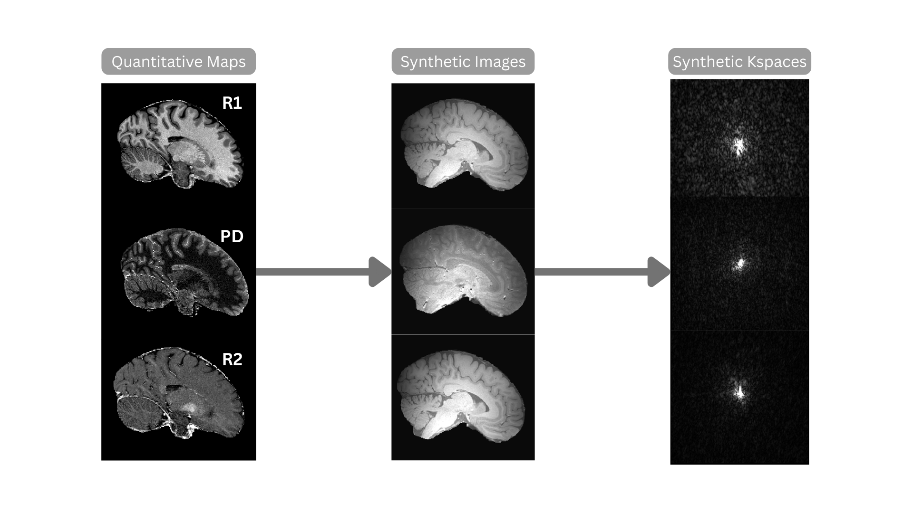

# Synthetic Image and k-Space Generation from Quantitative Multi-Parameter Maps

This project provides a comprehensive pipeline for generating synthetic weighted MRI images from quantitative multi-parameter maps (R1, R2s, PD). It allows for flexible adjustment of sequence parameters (TE, TR, FA) to simulate various image contrasts. The pipeline also includes functionality to calculate the corresponding k-space data for each coil in an MRI scanner by estimating sensitivity maps.



## Workflow
The core of this project is to take quantitative MRI maps (R1, R2s, PD) and generate realistic synthetic weighted images that would be produced by an MRI scanner with specific sequence parameters. This is achieved by applying the Ernst equation, which models the MRI signal intensity based on tissue properties and sequence parameters.
The main workflow is controlled by the `main.m` script. Here's a high-level overview of the steps:

1.  **Setup Paths and Parameters:** The `main.m` script starts by setting up the paths to the input data and defining the ranges for the sequence parameters (TE, TR, FA).
2.  **Generate Synthetic Images:** The `generate_synthetic_images.m` function is called to generate the synthetic weighted images. This function performs the following sub-steps:
    *   **Brain Extraction:** If specified, it extracts the brain from the quantitative maps using either `extract_brain_bet.m` or `extract_brain_fsl.m`.
    *   **B1 Map Registration:** It registers the B1 map to the quantitative maps using `register_b1_to_ref.m`
    *   **Signal Calculation:** It calculates the synthetic signal for each combination of TE, TR, and FA using `compute_ernst_signal.m`.
    *   **Save Images:** It saves the generated synthetic images as NIfTI files using `save_nifti_image.m` and writes the corresponding metadata to JSON files using `write_json_metadata.m`.
3.  **Generate B0 Maps:** The `runRomeo.m` function is called to generate B0 maps from multi-echo phase data.
4.  **Sensitivity Map Generation:** If not already present, it generates sensitivity maps using `create_smaps.m`.
5.  **Generate K-space Data:** The `nifti_to_kspace.m` function is called to convert the synthetic images to k-space data.
    *   **Phase evolution:** Phases of synthetic images  are assumed to be caused by phase portion of sensitivity maps and the B0 field inhomogenities under the assumption that phase evolves linearly with echo time.
    *   **Calculation of per-coil images:** Images are calculated for each coil seperately using respective sensitvity maps and stacked.
    *   **Taking FFT and Saving the images:** 3D FFT of each per-coil image is calculated and resulting k-space data is saved as seperate magnitude and phase NIFTI files, each with dimensions `(n_x, n_y, n_z, n_coil)`.
    *   **Adding Correlated Noise:** Noise covariance matrix is calculated from noise scans and gaussian noise is added based on the user-defined SNR.
    
## How to Run

1.  **Set up the environment:**
    *   Make sure you have MATLAB installed with the Image Processing Toolbox.
    *   Install FSL, make sure it's in your system's PATH and it's accesible from the terminal via `FSL` command.
    *   Install Julia and the required packages for ROMEO (`ROMEO`, `MriResearchTools`, `ArgParse`). Then install ROMEO following theinstructions in [this link](https://github.com/korbinian90/ROMEO.jl#usage---command-line).
2.  **Configure the paths:**
    *   Open the [config.m](./config.m) script and modify the paths in the "Setup paths" section to point to your data.
    *   We adopt the folder structure of hMRI-toolbox for input directory. Your patient directory (`patient_dir`) should be structured as below:
    ```
    /patient_dir/
    |
    ├── Results/                     # MPMs (there should be a corresponding json file for each nifti, containing essential metadata)
    │   ├── <R1_filename>.nii           # Must hace 'R1' in its name.
    │   └── <R2_filename>.nii           # Must have 'R2' in its name.
    │   └── <PD_filename>.nii           # Must have 'PD' in its name.
    │
    │
    ├── B1mapCalc/                   # B1+ (RF transmit sensitivity) maps
    │   ├── <B1map_filename>.nii        # Must have 'B1map' in its name.
    │   └── <B1red_filename>.nii        # Anatomical reference file for coregisteration. mUst have 'B1ref' in its name.
    │   
    ├── MPMCalc/                     # FOlder containing Tissue masks (GM, WM, CSF)
        ├── <gm_mask_filename>.m        # Must hace 'c1' in its name
        └── <wm_mask_filename>.m        # Must hace 'c2' in its name
        └── <csf_mask_filename>.m       # Must hace 'c3' in its name

    ```
    NOTE: If your input files are named differently, you can change file name patterns from [create_data_struct.m](./src/utils/file_io/create_data_struct.m)
    * `kspace_path` should point to raw kspace. Pipeline is configured Siemens` twix file format with extension `.dat`. It is read and mapped by [mapVBVD.m](./src/scripts/mapVBVD.m). If you have the kspace data in a differetn format, consider editing the part in [create_smaps.m](./src/generation/create_smaps.m] where the data is imported. Make sure kspace is data is 3D and contains the ACS region even thoguh it is undersampled.
    * `im_mag_dir` should point to the directory where weighted (T1,PD etc.) magnitude images (which MPMs are created from) are stored.  Directory should contain each echo in a seperate NIFTI file. Make sure length of the list `real_echo_times` provided and number of NIFTI files in `im_mag_dir` match.
    * `im_phase_dir` should point to the directory where weighted (T1,PD etc.) phase images (which MPMs are created from) are stored.  Directory should contain each echo in a seperate NIFTI file. Make sure length of the list `real_echo_times` provided and number of NIFTI files in `im_phase_dir` match.
    * `espririt_path` should point to the directory where the MATLAB library Matlab Library including implementations of [SPIRiT, ESPIRiT, Coil Compression, SAKE](https://people.eecs.berkeley.edu/~mlustig/Software.html). You can download the library from [here](https://people.eecs.berkeley.edu/~mlustig/software/SPIRiT_v0.3.tar.gz).
    * `romeo_script_path` should point to your `romeo.jl file`. Please follow the steps in [here ](https://github.com/korbinian90/ROMEO.jl#usage---command-line) to setup ROMEO. You can copy your file into (./
    
    * `real_echo_times` be a list of echo times in ms. You can find the specific echo time in your sequence configuration file.
    * `sequence` determines according to which MRI sequence synthetic images will be generated. Currently, available options are *GRE*, *MP2RAGE*, *FSE*, *FLAIR*.
    * `TE_values` specifies the echo times (ms) used for generating synthetic weighted images.  
    * `TR_values` specifies the repetition times (ms) for the sequence.  
    * `FA_values` lists the flip angles (degrees) used for each acquisition.  
    * `TI_values` specifies the inversion times; for *MP2RAGE*, values are given as pairs (first and second inversion), while for *FSE* they are listed individually.  
    
    * `extract_brain` selects the method for brain extraction (`bet`, `tissue_maps`, or `no`).  
    * `interp_method` specifies the interpolation method for resampling images. Available options are `trilinear`, `nearestneighbour`, `cubic`, `spline`.  
    * `threshold_tmap` sets the threshold for brain extraction when using tissue probability maps. Smaller values yield larger brain outlines. 
    * `threshold_bet` sets the fractional intensity threshold for BET-based brain extraction. Smaller values yield larger brain outlines.  
    * `signal_constant` is a multiplicative scaling factor applied to signal intensity to represent scanner- and sequence-dependent scaling.  
    * `add_RF_bias` determines whether RF sensitivity bias is reintroduced to the synthetic images (not recommended if MPMs are already bias-corrected).  
        
    * `smap_params.ncalib` defines the size of the auto-calibration region (ACS) in k-space.  
    * `smap_params.ksize` sets the kernel size for ESPIRiT calibration. Larger kernels increase runtime quadratically.  
    * `smap_params.eigThresh1` is the eigenvalue threshold for selecting eigenvectors when constructing the reconstruction matrix.  
    * `smap_params.eigThresh2` is used to only select eigenvectors with eigenvalues greater than eigThresh2 for the construction of sensititvity maps. If there is multiple eigenvectors with eigenvalue greater than eigThres2, resulting sens_map will be a linear combination of those. 
    * `smap_params.show_figures` controls the verbosity of ESPIRiT visualizations (`none`, `essential`, `detailed`).  
    * `smap_params.verbose` toggles detailed ESPIRiT console output.  
    * `smap_params.smoothing_radius` specifies the radius of the Gaussian smoothing kernel applied to coil sensitivity maps.  
    
    * `kspace_params.fft_shift` applies an `fftshift` during Fourier transforms. 
    * `kspace_params.normalize` normalizes k-space data during FFT.  
    * `kspace_params.verbose` toggles detailed console output during FFT operations.  
    * `kspace_params.save_complex` determines whether both magnitude and phase NIfTI files are saved (otherwise only magnitude is stored).  
    
    * `noise_params.SNR_dB` sets the target signal-to-noise ratio (dB). Use `-1` to disable noise addition.  
    * `noise_params.add_correlated_noise` enables correlated noise simulation using covariance matrices from noise scans (otherwise uncorrelated AWGN is added).  
    * `noise_params.num_variations` specifies the number of synthetic noise realizations generated per weighted image.  
    


    
3.  **Run the script:**
    *   Run the `main.m` script in MATLAB.

The script will then generate the synthetic images, k-space data, and B0 maps in the specified output directory.

## Function Descriptions

Here is an overview of the functions in the project, with a focus on the generation pipeline.

### Generation Functions

These functions are the core of the synthetic data generation process.

-   `generate_synthetic_images.m`: Orchestrates the entire synthetic image generation workflow. It iterates through all combinations of sequence parameters (TE, TR, FA, etc.) defined in `config.m` and calls `compute_ernst_signal` for each combination.
-   `compute_ernst_signal.m`: The primary signal calculation engine. It computes the MRI signal intensity based on the input quantitative maps (R1, R2s, PD) and the specified sequence parameters. It supports multiple MRI sequences, including Gradient Echo (GRE), MP2RAGE, Fast Spin Echo (FSE), and FLAIR, by applying the appropriate physical signal equations for each.
-   `create_smaps.m`: Computes coil sensitivity maps (smaps) from raw k-space data using the ESPIRiT algorithm. It reads a Siemens TWIX file, calibrates the k-space data, and saves the resulting sensitivity maps as both magnitude and phase NIfTI files.
-   `nifti_to_kspace.m`: Converts the generated synthetic images from the image domain to the k-space domain. This process involves applying the B0 field inhomogeneity map and the previously generated coil sensitivity maps to simulate realistic, multi-coil k-space data. It performs an inverse FFT on the resulting coil images.
-   `simulate_noise.m`: Adds noise to the k-space data to simulate a realistic acquisition. It can add either uncorrelated Additive White Gaussian Noise (AWGN) or correlated noise. For correlated noise, it calculates a noise covariance matrix from noise scans in the provided TWIX file. The noise level is controlled by the `SNR_dB` parameter in `config.m`.
-   `runRomeo.m`: A wrapper script that executes the ROMEO (Robust Phase-unwrapping) algorithm. It takes multi-echo magnitude and phase images as input, merges them into 4D NIfTI files, and calls the `romeo.jl` Julia script to perform phase unwrapping and calculate the B0 field map.
-   `kspace_to_nifti.m`: Performs the reverse operation of `nifti_to_kspace.m`. It reconstructs an image from complex k-space data (magnitude and phase files) by applying a forward FFT. This is useful for validating the k-space data.

### Preprocessing Functions

These functions prepare the input data for the generation pipeline.

-   `extract_brain.m`: A wrapper for brain extraction. It can use either FSL's BET tool (`bet`) or combine tissue probability maps (`tissue_maps`) to create a brain mask.
-   `register_b1_to_ref.m`: Coregisters the B1 map to the reference quantitative maps (e.g., R1 map) to ensure they are in the same spatial alignment.
-   `resize_b1_map.m`: Resizes the B1 map to match the exact matrix dimensions of the reference data, using the specified interpolation method.
-   `fixHotPixels.m`: Detects and corrects extreme outlier "hot pixels" in an image, which can otherwise cause artifacts in subsequent processing steps.

### Main Functions

-   `main.m`: The main script that drives the entire pipeline from start to finish. It loads the configuration, validates it, and calls the generation and processing functions in the correct order.
-   `config.m`: The central configuration file for the project. **All user-specific settings must be defined here**, including paths to data, sequence parameters, and processing options.

### File I/O Utilities

-   `create_data_struct.m`: Automatically scans the input directories defined in `config.m` and creates a structured variable (`data_struct`) that holds the paths to all required input files (R1, PD, B1 maps, etc.).
-   `load_mri_data.m`: Loads the actual image data and header information from the NIfTI files listed in the `data_struct`.
-   `read_twix.m`: Reads raw data from Siemens TWIX (`.dat`) files using the `mapVBVD` script. It can be used to extract k-space data or noise scan data.
-   `save_nifti.m`: A robust function for saving NIfTI files that includes multiple fallback methods to prevent errors.
-   `save_nifti_image.m`: A simpler wrapper function for saving NIfTI images.
-   `write_comprehensive_json.m`: Creates detailed JSON metadata files for the generated images, including sequence parameters, processing history, and NIfTI header information.
-   `write_json_metadata.m`: A simpler function to write essential metadata to a JSON file.
-alidation Utilities

-   `validate_config.m`: Performs a series of checks on the `config.m` file to ensure all paths are valid and parameters are within reasonable ranges before starting the main pipeline.
-   `validate_mri_data.m`: Checks that all required input quantitative maps (R1, R2s, PD) are present and have consistent dimensions.
-   `synthImageEval.m`: A powerful tool for validation that compares a generated synthetic image against a ground-truth reference image. It computes several similarity metrics, including NRMSE, SSIM, Pearson correlation, and Mutual Information.

### Visualization Utilities

-   `view_brain_slices.m`: A simple utility to display orthogonal (axial, sagittal, coronal) views of a 3D NIfTI volume.
-   `visualize_ESPIRIT.m`: Visualizes the output of the ESPIRiT algorithm, showing all individual channel images and the final root-mean-square (RMS) combined image.
-   `visualize_smap.m`: Visualizes the coil sensitivity maps.


## Dependencies

-   MATLAB (with Image Processing Toolbox)
-   FSL
-   BART
-   Julia (with `ROMEO`, `MriResearchTools`, `ArgParse` packages)

